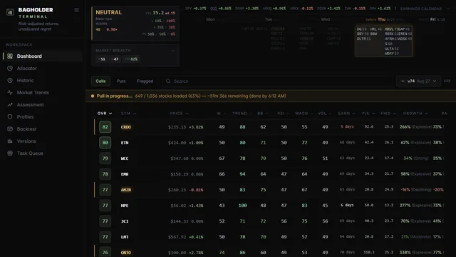

# Bagholders

Scores about 74,000 stocks from 0 to 100 every night and turns the strongest scores into ATM options entries for a live portfolio.



Live at https://trader.yaqzan.dev (also bagholders.ai; moving to quant.yaqzan.dev). The code, the `trader.py` CLI and the database still go by the project's original name, Trader.

## The nightly score

Every evening the updater pulls the day's OHLCV for the whole universe and rescores it. A score is a weighted blend of six technical reads on the chart: trend, position inside the Bollinger bands, RSI, MACD, stochastic, and how well those signals agree with each other. On top of that sit four adjustments applied in a fixed order: a weekly bias, a MACD gate, a volume multiplier, and a market-regime multiplier built from VIX and breadth (McClellan, TRIN, advance-decline, 52-week highs and lows, Zweig, Hindenburg).

The MACD gate is asymmetric. When a stock's score before MACD is under 45, MACD's weight goes to zero and is spread over the other components. MACD lags, and on bearish setups that lag kept suppressing real signals. The call side never had the problem, so it keeps the full weight.

Scores of 70 and up are call candidates and 25 and under are put candidates. A separate classifier reads the shape of the thesis and picks a days-to-expiry range for each one, and the strongest signals go out as push notifications.

## Nothing ships without proof

The scoring model is only half the project. The other half is the gate a change has to pass before the portfolio sees it. First a vol-adjusted barrier-touch backtest over five years of real price history. Then a Monte Carlo run of 500 iterations across three collision modes and six historical windows, measuring drawdown. A formula change that loses either one stays in the experiments folder.

Capacity gets the same treatment. I checked historical entries against real daily volume, and at my deployment size 53.5 to 75.2 percent of them could not have absorbed even a 5 to 20 contract clip within a quarter of that day's volume. That number shapes position sizing more than any backtest return does.

Every formula change also freezes a full copy of the scoring code under its own version number (v27 through v74 so far), and scores are stored keyed by symbol, date and version. A score from last spring can be recomputed against the exact code that produced it, at query time, without checking anything out.

## Running it

This is a personal, self-hosted tool. It runs on Windows against my own MySQL database, with data paths and job-queue sizing tuned for one machine. It is not turnkey, but the pieces are ordinary: Python 3.11, Node 18, MySQL (SQLite works for local development).

```bash
pip install -r trader_api_requirements.txt
npm install

python trader.py update    # pull today's data and score everything
python api.py              # Flask API on :5000
npm start                  # React dashboard on :3000
```

Configuration is environment variables only. `POLYGON_API_KEY` and `SHARADAR_API_KEY` for the paid market-data vendors, `PUSHOVER_USER_KEY` and `PUSHOVER_APP_TOKEN` for notifications, and `REACT_APP_API_URL` in the frontend `.env` so the dashboard can find the API.

Anything heavy, a full recalc or a Monte Carlo sweep, goes through a small priority job queue so it can never starve the nightly update. `experiments/` has the code and notes for every sweep mentioned above, without the result data those runs produced. `.claude/` holds the guidance I give Claude Code when it works in this repo; I develop with agents heavily and those docs are the project's memory.

```
database/            models, scoring engine, DB utilities
algorithm_versions/  frozen scoring code per version
experiments/         research sweeps and backtests (code and notes)
task_queue/          priority job queue
src/                 React frontend
```

This repo is a snapshot of my private working repo; the commit history is not published.

## License

MIT
